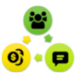
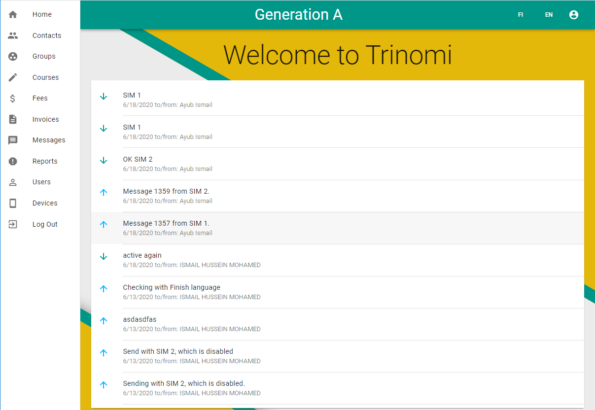
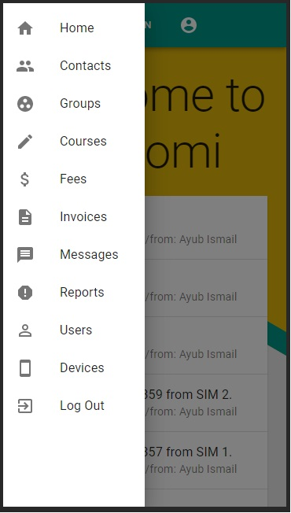
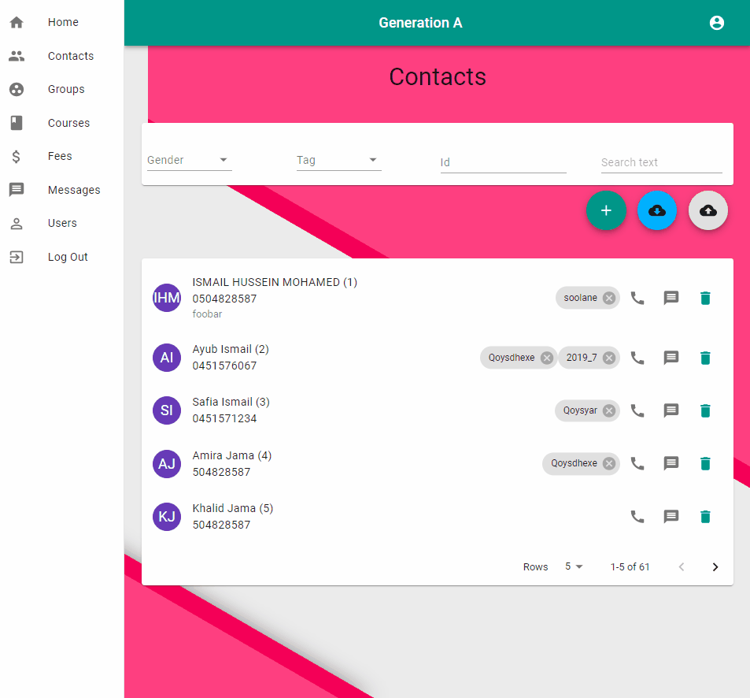
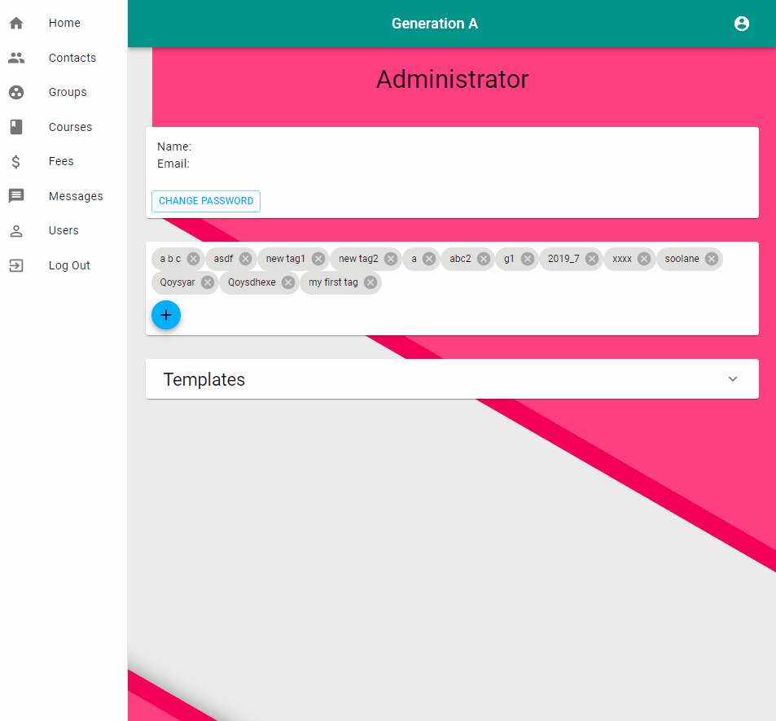
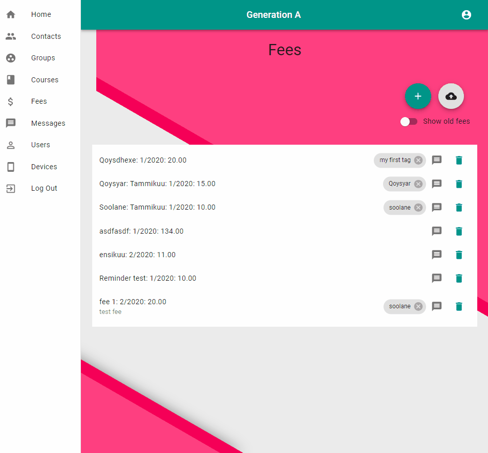
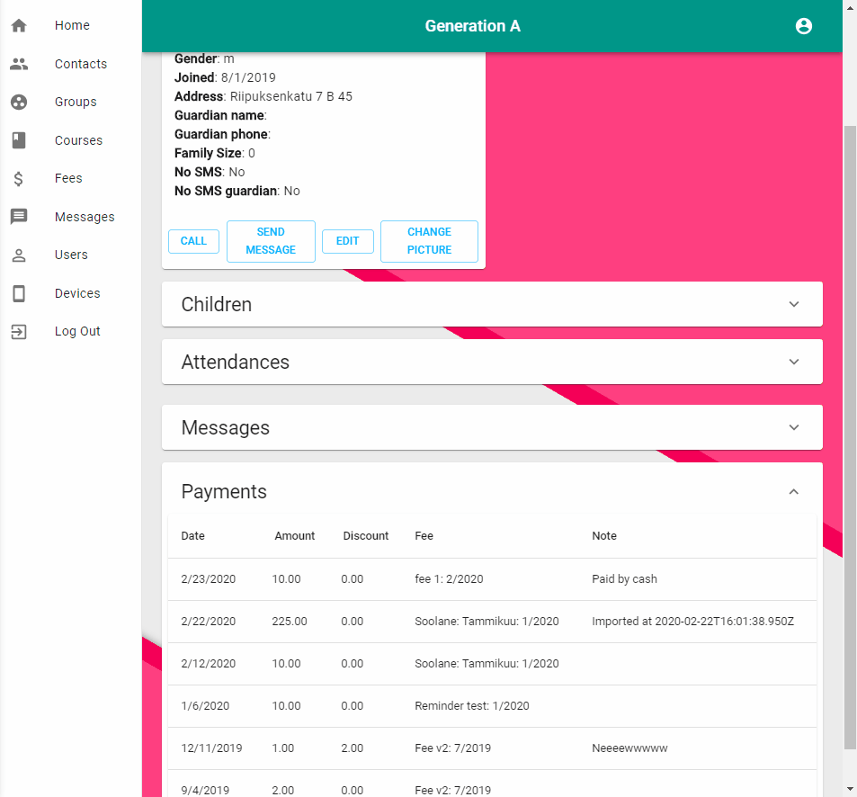
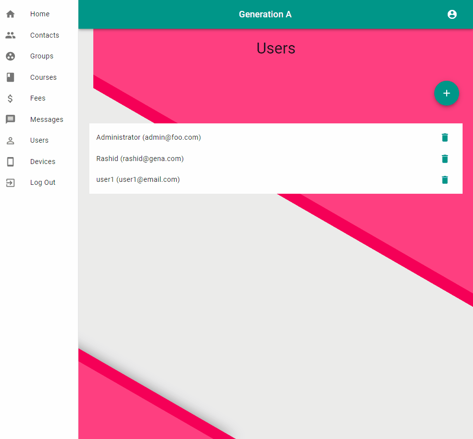
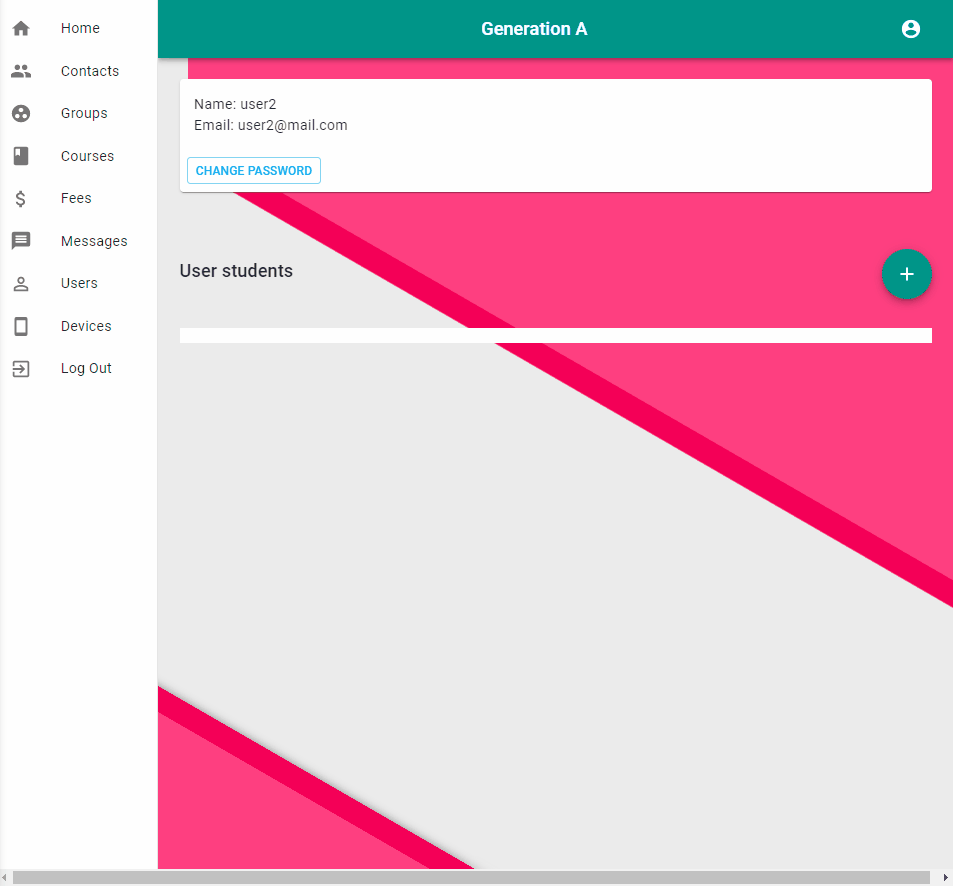

# Generation A (GenA)

## What is it?

GenA is a simple CRM application containing the most fundamental features only. It's meant for **small** to **medium** **schools**, **clubs**, **teaching centers**, **tuition centers** etc.

It's built to be simple and mobile friendly by design.

The fees management module can be used separately by any one who gets regular payments from customers/contacts and wants to track those payments.

Desktop and web version.

Mobile version.

## Contacts

**Contacts** are the core feature of the app. Contacts can be **students**, **members**, **guardians**, **teachers**, etc. GenA stores only basic information from each contact most notably name, gender, year of birth, phone number, family size, address, tags and notes. Only **name**, **gender** and **phone number** are required all other fields are optional.

Creating a new contact

Contacts can be filtered by gender, tag, id or a free text like name. Filter contacts is shown below.

## Tags

Tags offer a powerful and a simple way to categories and manage contacts. They can be anything that you might imagine. Some example tags might be: parent, teacher, kids, boys, girls, etc.

Tags are managed under the user profile and only user with administrator role can change/modify them.

Managing tags

Tags can be assigned to contacts, groups, courses and fees.

Adding tag to contact, group course or fee is shown below.

## Groups

Groups are based on tags and they offer two features: **calendar** and **messaging** for group of related contacts. Calendar widget of the group is shown on the bottom of the group. Above calendar there is messages sent to this group. Calendar events can be one time or recurring events.

Group membership is based on tags, any contact that has any of the tags of the group will be part of that group.

Creating calendar event

## Courses

Courses are very similar to groups.

## Fees

Manage easily fees here. Create a new fee by specifying year, month and amount. Specify target contacts by adding **tags** to the fee. See details of the fee including current payments and statistics.

By default on fees of this year are shown and old ones are hidden.

On the top of the fee details page there are shortcuts to other fees.

Then comes details of this fee. Pie chart shows current payment statistics.

Below the chart there is the target contacts of the fee.

### Payments

Fee payments can be created easily on the bottom of the fee details page.

Payments to multiple fees can be imported easily at one. The UI allows making corrections before actually importing the fees.

## Messages

Messaging based on SMS is one of the core features of GenA. Message can target individual contact, a group, a course or fee. Two-way communication is possible allowing GenA to receive messages from registered contacts.

Automatic messages for events and fees are supported.

## Users and Devices

New users can be created easily. There three roles available: admin, instructor and cashier currently.

## Devices

This page shows the status of the devices

